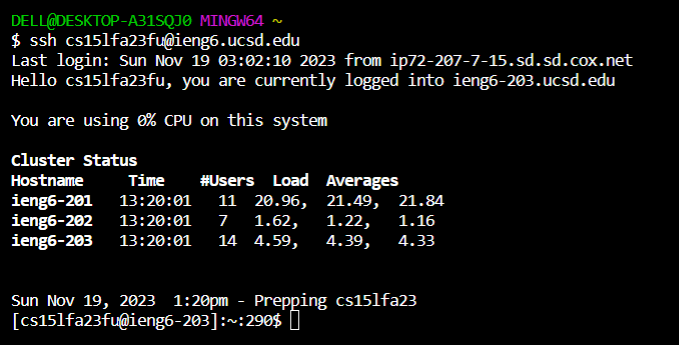
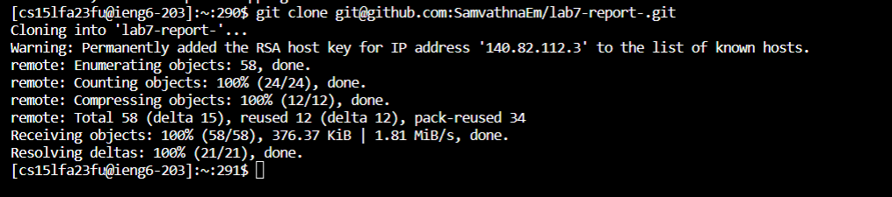
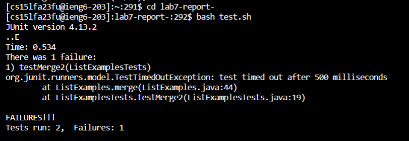
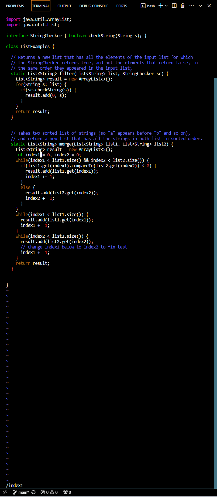
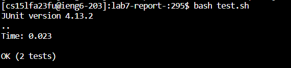
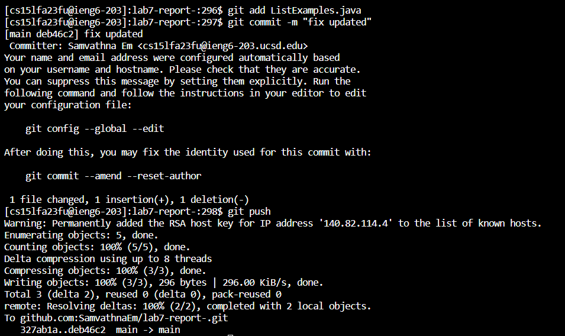
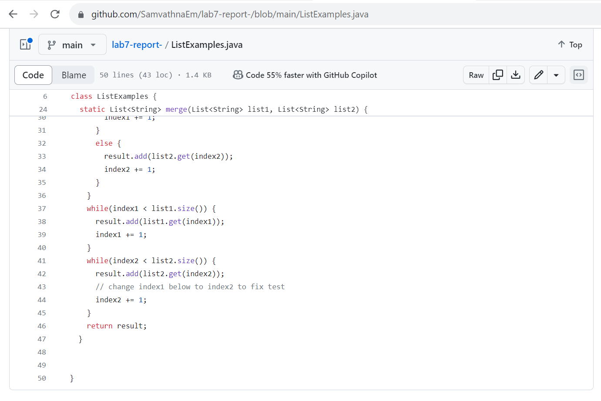

# Step 4: Log into ieng6


*Keys pressed:* ```Ctrl-C```, ```Ctrl-V``` and ```<enter>```.

Copy the ```ssh cs15lfa23fu@ieng6.ucsd.edu``` phrase I saved on my note in Google Docs by pressing ```Ctrl-C``` after highlighting that phrase, and then I pasted it on the terminal by pressing ```Ctrl-V``` and ```<enter>```. 

# Step 5: Clone my fork of the repository from my Github account (using the SSH URL)


*Keys pressed:* ```Ctrl-C```, type ```git clone```, ```Ctrl-V```, and ```<enter>```.

Copy the ssh URL ```git@github.com:SamvathnaEm/lab7-report-.git``` of the **lab7-report-** repository from my Github account by pressing ```Ctrl-C``` after highlighting that URL and clone that repository into ieng6 by using ```git clone```, and pressing ```Ctrl-V``` to paste the ssh URL we just copied, and pressed ```<enter>``` to run the command.
# Step 6: Run the tests, demonstrating that they fail


*Keys pressed:* Type ```cd lab7-report-``` and press ```<enter>```.
                Then type ```"bash te"```, press ```<tab>``` and ```<enter>```.

First, we have to change the working directory to ```/lab7-report-``` directory, and then run the bash scripts in ```test.sh``` by using ```bash``` command to run the tests. Then press ```<tab>``` after finishing typing ```"bash te"``` in the terminal to speed up the process by overwriting the existing filename inside the  ```/lab7-report-``` directory.

# Step 7: Edit the code file to fix the failing test
.png)

*Keys pressed:* Type ```vim ListExamples.java```and press ```<enter>```.

In this step, I use ```vim``` command to make editions of the content in the ```ListExamples.java``` file. 
After running that command, it shows us the content inside ListExamples.java in normal mode(like the screenshot below).



*Keys pressed:* Type ```/index1```, press ```<enter>```, then press ```n``` ```n``` ```n``` ```n``` ```n``` ```n``` ```n``` ```n``` ```n```, then press ```c``` ```w```, then type ```index2```, press ```<esc>```, type ```:wq```

Since we already know that the error in the code is just that ```index1``` is used instead of ```index2``` in the final loop in ```merge```, we use ```/``` and type a search term (```index1```) to find it in that file. Then, we have to use ```n``` to go to the next occurrence of that term appearing in the file, which in our case, we're supposed to press ```n``` 9 times to get to the right term we want to edit. After we get to the term we want to change, we have to press ```c``` ```w``` (change word) and type the new word ```index2```to replace the old string. Then, we press ```<esc>``` to switch from edit mode to normal mode and type ```:wq``` to save and quit. 
# Step 8: Run the tests, demonstrating that they now succeed


*Keys pressed:* type ```"bash te"```, press ```<tab>``` and ```<enter>```.

We run the bash scrips in ```test.sh``` again by using ```bash``` command to run the tests. Then press ```<tab>``` after finishing typing ```"bash te"``` in the terminal to speed up the process by overwriting the existing filename inside the  ```/lab7-report-``` directory. It succeeds now.

# Step 9: Commit and push the resulting change to my Github account

*Keys pressed:* type ```git add ListExamples.java``` and press ```<enter>```. Then, type ```git commit -m "fix updated"``` and press ```<enter>```. After that, type ```git push``` and press ```<enter>```

We run the ```git add``` command on the terminal to stage a file we just edited to be part of the next commit. Then, we run ```git commit``` to create a commit locally for all added/staged files. After that, we run ```git push``` to copy all new commits to the remote Github account.

Here's the result after the listExamples.java file gets pushed to my GitHub account from the web browser.



